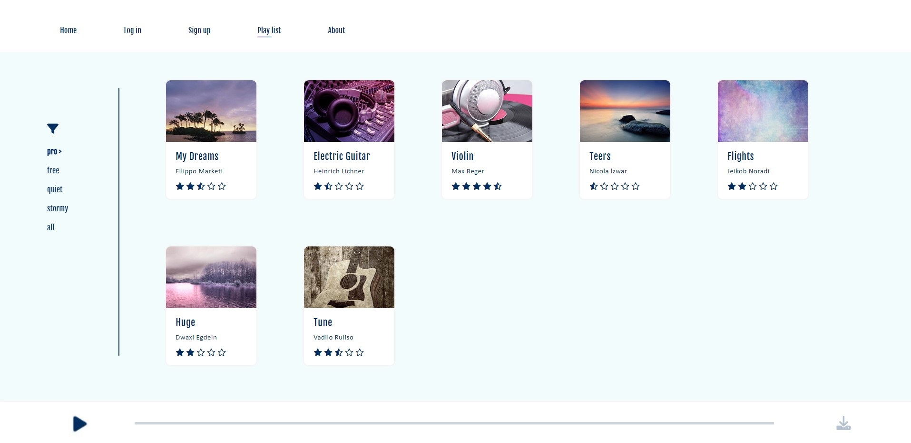
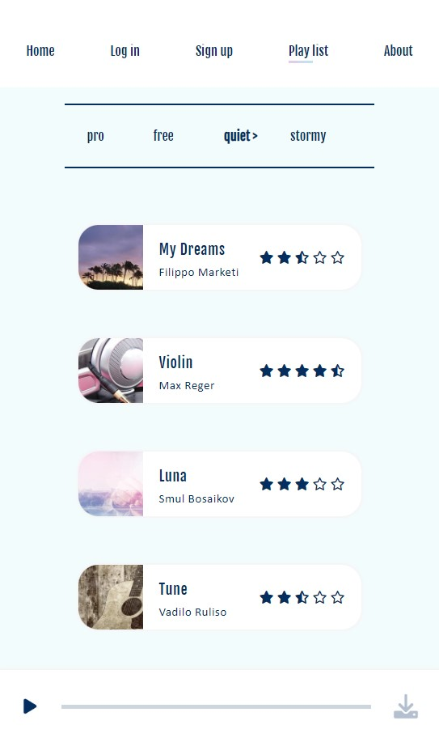
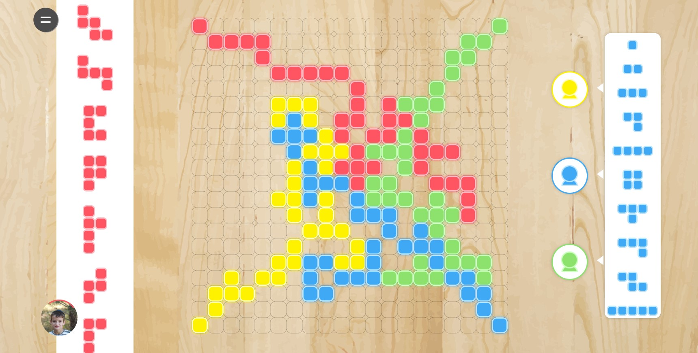
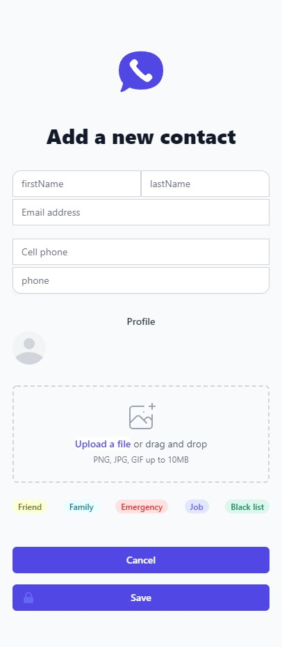
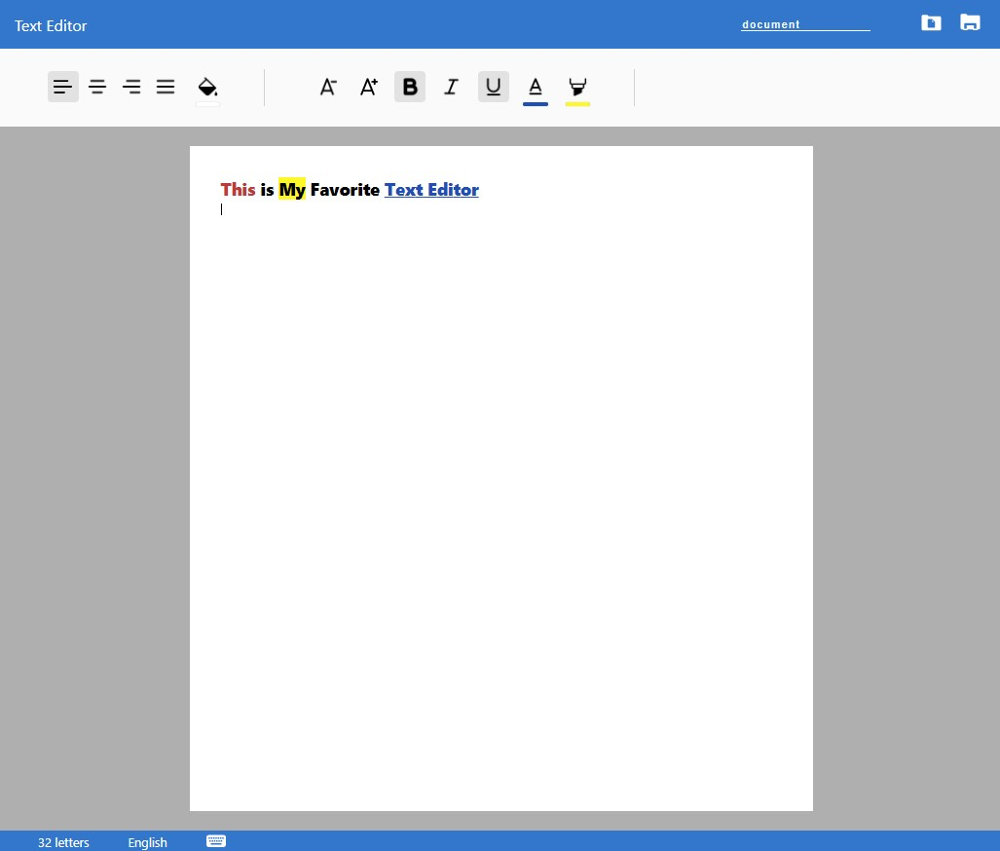
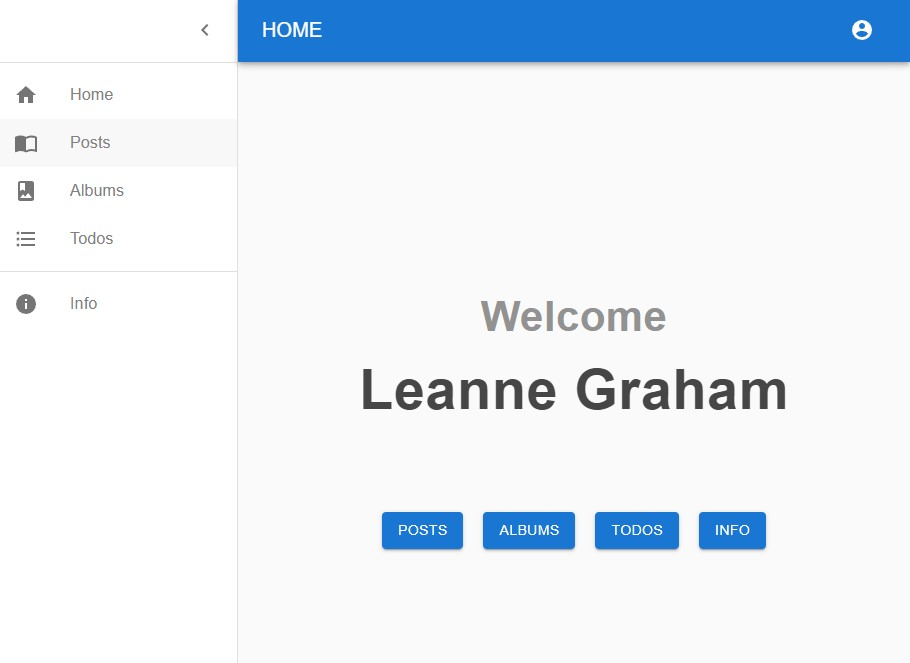

# FEWD_Projects

## Project 1

A static responsive HTML and CSS website, it uses some css tricks to give the user a dynamic site feel.

*screenshots*

## Project 2

Blokus strategy game - vanilla js. Can you be smarter than the computer?

*screenshot*

## Project 3

A demo server which can handle fake Ajax requests to serve a Single Page Application of contacts database.

*screenshot*

## Project 4

### A Simple Math Game

Get to 100 - A simple math game. built using React.

*screenshot*

### Text Editor

A basic text editor includes save & open functionality. The files are stored as JSON files to enable format saving.
*screenshot*

## Project 5

React Database application. Working with React-Router and Material-Design

*screenshot*

